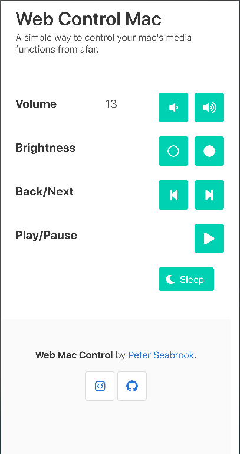

## Flask Mac Control

#### Description
This is a web port of raspberry pi zero mac control written in 
python, flask and javascript on top of Bulma.io framework.

It will allow you basic control of your mac from somewhere like bed 
or a couch where you are connected to the same network.




### Installation & Running
From the src after you have setup your desired virtual environment:
```
pip install -r requirements.txt
export FLASK_APP="run.py"
flask run --host=0.0.0.0
```
Note if you don't set the host it will default to only accepting 
connections from the host machine(127.0.0.1)

### Controls
The controls are pretty straight forward and do as they say.

Currently supported:
 * Volume up/down
 * Brightness up/down
 * Back/Next
 * Play/Pause
 * Sleep
 
### Future Features
 * Shutdown button